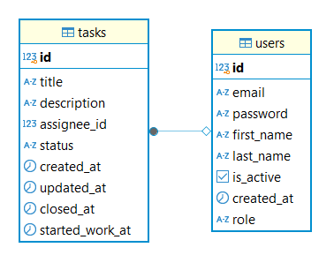

# task-tracker

Этот проект предоставляет API для работы с задачами. Он позволяет получать данные о задачах с пагинацией
и сортировкой, фильтровать записи, добавлять/обновлять данные, а также получать некоторые статистические показатели.

Реализована поддержка двух типов профилей пользователей: USER (обычный пользователь) и ADMIN (администратор).
Администратор может делать любые дествия с данными в том числе и других пользователей. 
Обычный пользователь может работать только со своими данными.

## Запуск проекта

1. **Клонируйте репозиторий**:
   ```bash
   git clone https://github.com/GARFIELD-CAT/task-tracker.git
   ```

2. **Перейдите в каталог проекта**:
   ```bash
   cd task-tracker
   ```

3. **Разверните базу данных Postgres**:
   Убедитесь, что у вас установлен Docker и Docker Compose. Запустите команду:
   ```bash
   docker-compose up -d
   ```

4. **Установите зависимости**:
- Разверните venv окружение `py -3.12 -m venv venv`
- Активировать venv окружение `.\venv\Scripts\activate.bat`
  - Если используется PowerShell `.\venv\Scripts\Activate.ps1`
  - Если используете bash: `source ./venv/Scripts/activate`
- Установить poetry `pip install poetry`
- Установить зависимости `poetry install`

5. **Заполните базу данными**:
- Выполните команду `alembic upgrade head`

6. **Запустите проект**:
   Запустите проект командой: `uvicorn app.main:app --reload`

7. **Swagger UI будет доступен по URL**:
   ```
   http://localhost:8080/api/openapi
   ```

## Основные возможности сервиса

- Получение списка задач и пользователей с пагинацией и сортировкой
- Доступ к отдельным задачам и пользователям по ID
- Создание, обновление и удаление задач и пользователей
- Фильтрация задач и пользователей по параметрам
- Получение аналитики по задачам и пользователям
- Реализована защита api с помощью авторизации и разделения прав пользователей. Для тестирования доступны пользователи:

 ```json
[
  {
    "email": "admin@example.com",
    "password": "hashedPassword1",
    "role": "ADMIN"
  },
  {
    "email": "user1@example.com",
    "password": "hashedPassword1",
    "role": "ADMIN"
  }
]
```

## Схема базы данных


Данная схема была выбрана, так как покрывает весь функционал проекта.

В идеале роли пользователей нужно выностить в отдельную сущность, но для учебного проекта посчитал избыточным

## Запуск тестов
- Сейчас используется продовая база для тестов. По хорошему нужно использовать отдельную базу для тестирования.
- Выполните команду `pytest -v`


## Использование API

Вот документация для вашего API в запрашиваемом формате:

---

### 1. Аналитика по задачам и пользователя

- **URL**: `http://localhost:8000/api/v1/analytics/reports`
- **Метод**: `GET`
- **Ответ**: 
    - **200 OK**: HTML-код визуализации данных.
    - **404 Not Found**: Если нет данных для отображения.    

**Пример запроса**:

```http
GET http://localhost:8000/api/v1/analytics/reports
```

---

### 2. Регистрация пользователя

- **URL**: `http://localhost:8000/api/v1/auth/register`
- **Метод**: `POST`
- **Тело запроса**:
    - `input` (CreateUser) - Данные для регистрации пользователя.

**Пример тела запроса**:
```json
{
    "email": "user@example.com",
    "password": "Password123",
    "first_name": "Имя",
    "last_name": "Фамилия"
}
```

**Ответ**:
- **201 Created**: Информация о созданном пользователе.
- **400 Bad Request**: Если данные некорректны.

**Пример запроса**:

```http
POST http://localhost:8000/api/v1/auth/register
Content-Type: application/json

{
    "email": "user@example.com",
    "password": "Password123",
    "first_name": "Имя",
    "last_name": "Фамилия"
}
```

---

### 3. Получение токена

- **URL**: `http://localhost:8000/api/v1/auth/token`
- **Метод**: `POST`
- **Тело запроса**:
    - `input` (LoginData) - Данные для входа.

**Пример тела запроса**:
```json
{
    "email": "user@example.com",
    "password": "Password123"
}
```

**Ответ**:
- **200 OK**: Токен доступа.
- **401 Unauthorized**: Неверные данные для входа.

**Пример запроса**:

```http
POST http://localhost:8000/api/v1/auth/token
Content-Type: application/json

{
    "email": "user@example.com",
    "password": "Password123"
}
```

**Пример ответа**:
```json
{
    "access_token": "your_access_token",
    "token_type": "bearer"
}
```

---

### 4. Создание задачи

- **URL**: `http://localhost:8000/api/v1/tasks`
- **Метод**: `POST`
- **Тело запроса**:
    - `input` (CreateTask) - Данные для создания задачи.

**Пример тела запроса**:
```json
{
    "title": "Новая задача",
    "description": "Описание задачи",
    "status": "TO_DO"
}
```

**Ответ**:
- **201 Created**: Информация о созданной задаче.
- **400 Bad Request**: Если данные некорректны.

**Пример запроса**:

```http
POST http://localhost:8000/api/v1/tasks
Content-Type: application/json

{
    "title": "Новая задача",
    "description": "Описание задачи",
    "status": "TO_DO"
}
```

---

### 5. Получение списка задач

- **URL**: `http://localhost:8000/api/v1/tasks`
- **Метод**: `GET`
- **Параметры**:
    - `skip` (int, default: 0) - Пропустить количество элементов.
    - `limit` (int, default: 25) - Максимальное количество элементов.
    - `sort_by` (String, default: "id") - Поле для сортировки.
    - `ascending` (bool, default: true) - Направление сортировки.
    - `filter` (TaskFilter) - Фильтры для поиска задач.

**Пример запроса**:

```http
GET http://localhost:8000/api/v1/tasks?skip=0&limit=25&sort_by=id&ascending=true
```

**Ответ**:
- **200 OK**: Список задач.

---

### 6. Получение конкретной задачи

- **URL**: `http://localhost:8000/api/v1/tasks/{id}`
- **Метод**: `GET`
- **Параметры**:
    - `id` (int) - ID задачи.

**Пример запроса**:

```http
GET http://localhost:8000/api/v1/tasks/1
```

- **Ответ**:
    - **200 OK**: Информация о задаче.
    - **404 Not Found**: Если задача не найдена.

**Пример ответа**:
```json
{
    "id": 1,
    "title": "Новая задача",
    "description": "Описание задачи",
    "assignee_id": 2,
    "status": "TO_DO",
    "created_at": "2026-01-25T12:00:00",
    "updated_at": "2026-01-25T12:00:00",
    "closed_at": null,
    "started_work_at": null
}
```

---

### 7. Обновление задачи

- **URL**: `http://localhost:8000/api/v1/tasks/{id}`
- **Метод**: `PATCH`
- **Параметры**:
    - `id` (int) - ID задачи.
- **Тело запроса**:
    - `input` (UpdateTask) - Обновляемые данные задачи.

**Пример тела запроса**:
```json
{
    "title": "Обновленная задача",
    "description": "Новое описание задачи",
    "assignee_id": 2,
    "status": "IN_PROGRESS"
}
```

**Пример запроса**:

```http
PATCH http://localhost:8000/api/v1/tasks/1
Content-Type: application/json

{
    "title": "Обновленная задача",
    "description": "Новое описание задачи",
    "assignee_id": 2,
    "status": "IN_PROGRESS"
}
```

**Ответ**:
- **200 OK**: Информация о обновленной задаче.
- **404 Not Found**: Если задача не найдена.
- **400 Bad Request**: Если данные некорректны.

---

### 8. Удаление задачи

- **URL**: `http://localhost:8000/api/v1/tasks/{id}`
- **Метод**: `DELETE`
- **Параметры**:
    - `id` (int) - ID задачи.

**Пример запроса**:

```http
DELETE http://localhost:8000/api/v1/tasks/1
```

**Ответ**:
- **204 No Content**: Успешное удаление задачи.
- **404 Not Found**: Если задача не найдена.

---

### 9. Получение информации о текущем пользователе

- **URL**: `http://localhost:8000/api/v1/users/me`
- **Метод**: `GET`
- **Ответ**:
    - **200 OK**: Информация о текущем пользователе.
    - **401 Unauthorized**: Если пользователь не авторизован.

**Пример запроса**:

```http
GET http://localhost:8000/api/v1/users/me
```

**Пример ответа**:
```json
{
    "id": 1,
    "email": "user@example.com",
    "first_name": "Имя",
    "last_name": "Фамилия",
    "is_active": true,
    "role": "USER",
    "created_at": "2026-01-25T12:00:00"
}
```

---

### 10. Получение списка пользователей

- **URL**: `http://localhost:8000/api/v1/users`
- **Метод**: `GET`
- **Параметры**:
    - `skip` (int, default: 0) - Пропустить количество элементов.
    - `limit` (int, default: 25) - Максимальное количество элементов.
    - `sort_by` (String, default: "id") - Поле для сортировки.
    - `ascending` (bool, default: true) - Направление сортировки.
    - `filter` (UserFilter) - Фильтры для поиска пользователей.

**Пример запроса**:

```http
GET http://localhost:8000/api/v1/users?skip=0&limit=25&sort_by=id&ascending=true
```

**Ответ**:
- **200 OK**: Список пользователей.

**Пример ответа**:
```json
[
    {
        "id": 1,
        "email": "user@example.com",
        "first_name": "Имя",
        "last_name": "Фамилия",
        "is_active": true,
        "role": "USER",
        "created_at": "2026-01-25T12:00:00"
    }
]
```

---

### 11. Получение конкретного пользователя

- **URL**: `http://localhost:8000/api/v1/users/{id}`
- **Метод**: `GET`
- **Параметры**:
    - `id` (int) - ID пользователя.

**Пример запроса**:

```http
GET http://localhost:8000/api/v1/users/1
```

**Ответ**:
- **200 OK**: Информация о пользователе.
- **404 Not Found**: Если пользователь не найден.

**Пример ответа**:
```json
{
    "id": 1,
    "email": "user@example.com",
    "first_name": "Имя",
    "last_name": "Фамилия",
    "is_active": true,
    "role": "USER",
    "created_at": "2026-01-25T12:00:00"
}
```

---

### 12. Обновление пользователя

- **URL**: `http://localhost:8000/api/v1/users/{id}`
- **Метод**: `PATCH`
- **Параметры**:
    - `id` (int) - ID пользователя.
- **Тело запроса**:
    - `input` (UpdateUser) - Обновляемые данные пользователя.

**Пример тела запроса**:
```json
{
    "email": "new_email@example.com",
    "first_name": "Новое имя",
    "last_name": "Новая фамилия"
}
```

**Пример запроса**:

```http
PATCH http://localhost:8000/api/v1/users/1
Content-Type: application/json

{
    "email": "new_email@example.com",
    "first_name": "Новое имя",
    "last_name": "Новая фамилия"
}
```

**Ответ**:
- **200 OK**: Информация о обновленном пользователе.
- **404 Not Found**: Если пользователь не найден.
- **400 Bad Request**: Если данные некорректны.

---

### 13. Удаление пользователя

- **URL**: `http://localhost:8000/api/v1/users/{id}`
- **Метод**: `DELETE`
- **Параметры**:
    - `id` (int) - ID пользователя.

**Пример запроса**:

```http
DELETE http://localhost:8000/api/v1/users/1
```

**Ответ**:
- **204 No Content**: Успешное удаление пользователя.
- **404 Not Found**: Если пользователь не найден.

---

### Примечания

- **Авторизация**: Для выполнения операций, требующих авторизации (например, работа с задачами и пользователями), необходимо передавать токен доступа в заголовке `Authorization: Bearer <токен>`.
- **Эндпоинты**: Все запросы к API начинаются с `/api/v1/`.


## Технологии

- FastAPI: Веб-фреймворк для создания асинхронных API.
- SQLAlchemy: ORM для работы с базами данных.
- Uvicorn: ASGI-сервер для запуска FastAPI приложений.
- Pydantic: Библиотека для валидации данных и схем.
- asyncpg: Асинхронный драйвер для PostgreSQL.
- psycopg2-binary: Драйвер для работы с PostgreSQL.
- Python-JOSE: Библиотека для работы с JSON Web Tokens (JWT).
- Passlib: Библиотека для безопасного хеширования паролей.
- Alembic: Инструмент для управления миграциями базы данных.
- Pandas: Библиотека для анализа и манипуляции данными.
- Plotly: Библиотека для визуализации данных.
- Poetry: Инструмент для управления зависимостями и сборки пакетов.
- pytest: Фреймворк для написания тестов.
- flake8: Инструмент для статического анализа кода.
- black: Автоформатер кода для Python.
- isort: Инструмент для сортировки импортов.
- mypy: Проверка типов в Python.